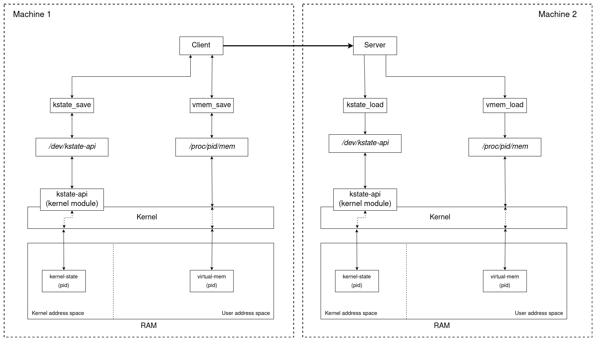
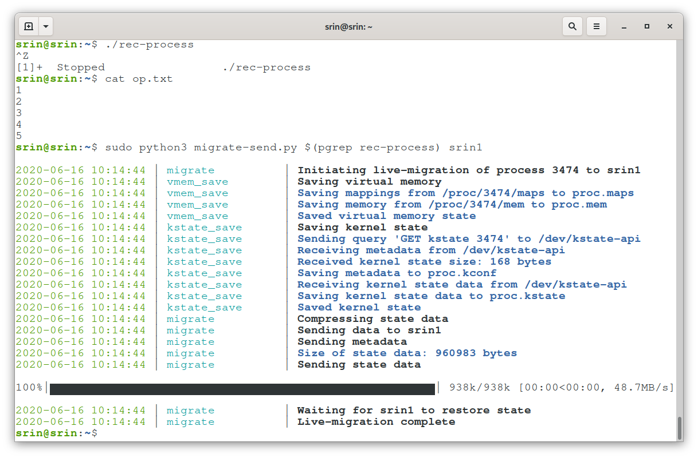

# process-migration-system
## System Design

## Demo
#### Migration source

#### Migration target

## Level of Process Migration Achieved
  * The Iterative and Recursive program.
    * It is successfully migrated from one machine to another with same Operating System(Linux) and same Kernel Version.
    * Virtual Memory Mapping:
      * A user space script is implemented which suspends the process in the current machine and transfers the virtual memory mapping to another machine.The               process is then resumed in the machine.
      * The transfer is achieved using socket programming.
    * Kernal State:
      * A kernel module is also developed to modify the kernel data structures in order to transfer the process control block information, mainly the CPU                   registers.
      * the transfer is acheived using socket programming.
  * An informative Comman line Interface is developed to display the current state of process migration and along with some details.

## Future Work
A process can have file dependencies. Files which will be required by the process in future can simply be copied to the target filesystem with the same file location. Linux's overlay filesystem can be useful here. For files that are currently open, in-addition to copying the file content, the file descriptors need to be updated in the kernel state. A process can depend on other processes. For example, any child processes, background services, etc. A process could be using hardware peripherals, which are represented as psuedo-files on Linux. Any open sockets have to be replicated on the target machine too. Further process metadata like scheduling priority have to be migrated.
